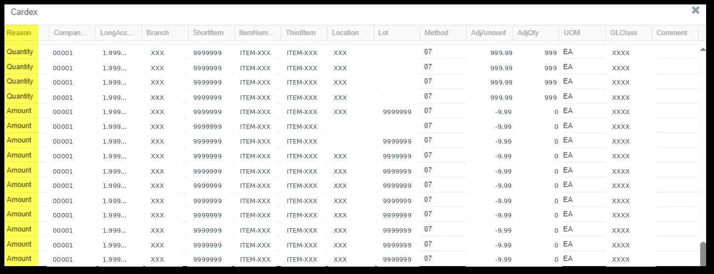
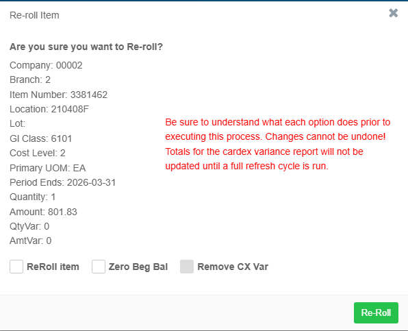
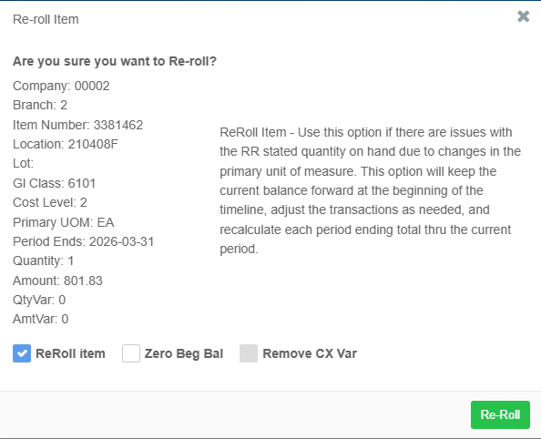
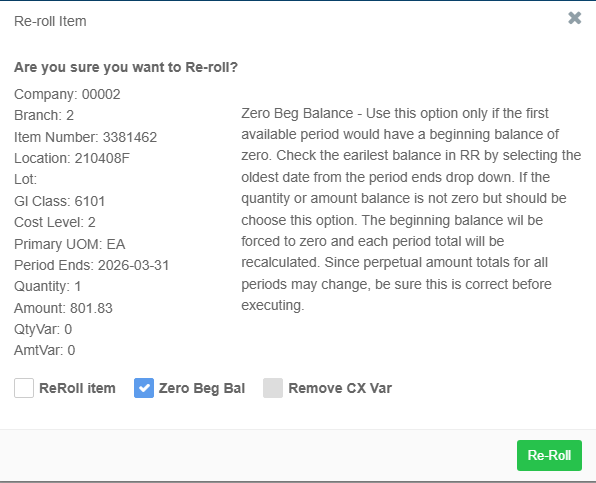
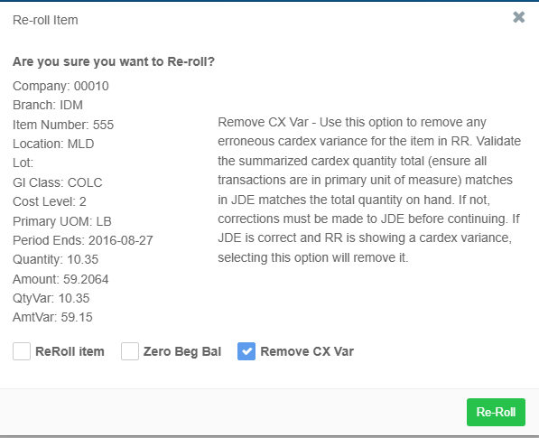

# How To: Resolve Cardex Integrity Variances

## Using RapidReconciler and JD Edwards to Identify and Correct Cardex Discrepancies

---

## Table of Contents

- [Overview](#overview)
- [Before You Begin](#before-you-begin)
- [Step 1 -- Open the Cardex Integrity Pop-Up in RapidReconciler](#step-1----open-the-cardex-integrity-pop-up-in-rapidreconciler)
- [Step 2 -- Validate the Variance in JD Edwards](#step-2----validate-the-variance-in-jd-edwards)
- [Step 3 -- Perform a Dollars-Only Adjustment in JD Edwards](#step-3----perform-a-dollars-only-adjustment-in-jd-edwards)
- [Step 4 -- Resolve the Variance in RapidReconciler Using Re-Roll](#step-4----resolve-the-variance-in-rapidreconciler-using-re-roll)
- [Step 5 -- Confirm the Result in RapidReconciler](#step-5----confirm-the-result-in-rapidreconciler)

---

## Overview

A cardex integrity variance occurs when the summarized quantity or extended amount in the item ledger does not match the on-hand balances in JD Edwards. Common causes include:

- Rounding errors accumulated over time
- Manual overrides of transaction costs
- Incorrect average cost calculations
- Unit of measure changes

**JD Edwards is the system of record.** RapidReconciler calculates its cardex variance only from the point in time when the program was first initiated, or from the date the data was last reset -- it does not have visibility into transaction history that predates that point. If a discrepancy exists between RapidReconciler and JD Edwards, the Re-Roll options are used to synchronize RapidReconciler to match JD Edwards -- not the other way around.

This guide walks through the full process -- from identifying a variance in RapidReconciler, validating it in JD Edwards, performing a correction in JD Edwards if needed, and synchronizing RapidReconciler using the Re-Roll options.

---

## Before You Begin

| Item | Detail |
|---|---|
| **Who should perform this** | Cost accountant or inventory accountant with appropriate JD Edwards security |
| **RapidReconciler access** | Required to identify and confirm variances |
| **JD Edwards access** | Required to validate and correct the underlying data |
| **Average cost environments** | A dollars only IA correction procedure requires an additional UDC configuration step -- read the full guide before proceeding |

---

## Step 1 -- Open the Cardex Integrity Pop-Up in RapidReconciler

The RapidReconciler Cardex Integrity pop-up compares the summarized item ledger (F4111) against the on-hand balance in the Item Location table (F41021) for every item in the system. It automatically excludes memo transactions, applies unit of measure conversions, and respects the cost level setting for average cost items.

> **Important:** RapidReconciler calculates its cardex variance only from the point in time when the program was initiated, or from the date the data was last reset. It does not have visibility into transaction history that predates that starting point. **JD Edwards is always the system of record.** Any variance shown in RapidReconciler should be validated against JD Edwards before taking corrective action. The Re-Roll options exist to bring RapidReconciler into alignment with JD Edwards -- not to correct JD Edwards data.

**1.1 Navigate to the Cardex Integrity pop-up**

From the RapidReconciler inventory reconciliation screen, open the Cardex Integrity pop-up. 
Hover over the cardex variance line in the variance calculation section. Click the green square to open the pop-up.

**1.2 Review the variance indicators**

The pop-up displays the following key fields for the item:

| Field | Description |
|---|---|
| **Reason** | Either Quantity or Amount |
| **Quantity** | The on-hand quantity recorded in RapidReconciler |
| **Amount** | The on-hand value recorded in RapidReconciler |
| **QtyVar** | The quantity variance between RapidReconciler and JD Edwards |
| **AmtVar** | The dollar variance between RapidReconciler and JD Edwards |

>Note: The pop-up also displays the item details. You may notice offsetting values for the same item. This can be do to incorrect transaction processing or incorrect updating of GL class codes or primary units of measure.

**1.3 Determine the type of variance**

| Quantity | Amount | Interpretation | Next Step |
|---|---|---|---|
| 0 | 0 | No variance -- no action needed | Stop |
| Non-zero | Any | Quantity discrepancy -- investigate quantity before addressing dollars | Investigate quantity first |
| **0** | **Non-zero** | **Dollar-only variance -- proceed with this guide** | **Step 2** |

> **Note:** The Cardex Integrity pop-up reflects data as of the most recent nightly refresh cycle. Any transactions that occurred after the last import will not be reflected until the following night's refresh is complete.

---

## Step 2 -- Validate the Variance in JD Edwards

Before making any correction, confirm the discrepancy by reviewing the item's transaction history directly in JD Edwards. Since JD Edwards is the system of record, this step determines the true source of the variance -- whether a correction needs to be made in JD Edwards, or whether RapidReconciler simply needs to be synchronized to match JD Edwards using the Re-Roll options.

**2.1 Export the cardex for the item**

Export all cardex transactions for the item from JD Edwards to Excel.

**2.2 Exclude memo transactions**

Remove all rows where column **ILIPCD** in table F4111 equals **"X"**. Memo transactions include work order scrap, lot releases, and certain warehousing movements. These do not impact the on-hand balance and must be excluded from the calculation.

**2.3 Summarize the remaining transactions**

Total the following columns from the remaining rows:

- **Quantity** -- expressed in the primary unit of measure
- **Extended Amount**

**2.4 Compare to JD Edwards balances**

Compare your summarized totals to the on-hand quantity and value displayed in JD Edwards.

| Result | Interpretation | Next Step |
|---|---|---|
| Quantity and amount both match JDE | JD Edwards is correct -- variance is isolated to RapidReconciler | Use the Re-Roll options (Step 4) |
| **Amount does not match JDE** | **A true dollar discrepancy exists in JD Edwards** | **Perform a dollars-only adjustment (Step 3)** |
| Quantity does not match JDE | A quantity issue exists -- this guide does not cover quantity corrections | Investigate the quantity discrepancy separately. May require IT intervention. |

---

## Step 3 -- Perform a Dollars-Only Adjustment in JD Edwards

Follow this procedure only if Step 2 confirmed that a true dollar discrepancy exists in JD Edwards. If JD Edwards is correct and the variance is in RapidReconciler only, skip to Step 4.

### 3.1 Determine Your Cost Environment

- **Standard Cost (Method 07)** -- Proceed directly to Step 3.3.
- **Average Cost (Method 02)** -- Complete Step 3.2 first.

---

### 3.2 Average Cost Only: Disable Average Cost Update for P4114

> **Skip this step if the item uses standard cost.**

In an average cost environment, program P4114 (Inventory Adjustments) is typically configured to recalculate the unit cost when a transaction is posted. If this recalculation runs during a dollars-only adjustment, it will change the average cost -- negating the intended correction.

**3.2.1** Enter **UDC** on the fast path, then enter **40/AV** and click Find.

**3.2.2** Locate program **P4114** in the table.

**3.2.3** Change the **Description 02** value from **"Y" to "N"** to disable the average cost update for P4114. Do not change any other programs.

> **Note:** This change takes effect immediately. Proceed to Step 3.3 without delay to minimize the window during which normal P4114 transactions would not update the average cost.

---

### 3.3 Process the IA Transaction

**3.3.1** Navigate to **Inventory Adjustments (P4114)** from the applicable inventory menu.

**3.3.2** Complete the following fields:

| Field | Value |
|---|---|
| **Item Number** | The item requiring adjustment |
| **Branch Plant** | The applicable branch plant |
| **Location** | The applicable location |
| **Lot Number** | The applicable lot number, if applicable |
| **Extended Amount** | The adjustment amount (positive to increase value, negative to decrease) |

**3.3.3** Leave the following fields blank:

| Field | Why |
|---|---|
| **Quantity** | Must be blank -- entering a quantity will change the on-hand balance |
| **Unit Cost** | Must be blank -- entering a unit cost will result in a quantity-based transaction |

> **Critical:** Leaving the Quantity and Unit Cost fields blank is what makes this a dollars-only adjustment. If either field contains a value, the transaction will not behave as intended.

**3.3.4** Review and post the IA transaction. The adjustment will appear in the cardex (F4111) with the correct dollar amount and corresponding GL entries.

---

### 3.4 Verify the JD Edwards Adjustment

**3.4.1** Open the item ledger (F4111) and confirm the IA transaction appears with the correct extended amount and a quantity of zero.

**3.4.2** Re-export the cardex to Excel, re-apply the exclusion for ILIPCD = "X", and re-summarize to confirm the extended amount total now ties to the JD Edwards balance.

**3.4.3** Verify that the corresponding GL entries have been created and posted to the correct inventory account.

---

### 3.5 Average Cost Only: Restore UDC Table 40/AV

> **Skip this step if the item uses standard cost.**

**Immediately after verifying the adjustment**, restore the UDC 40/AV setting for P4114.

**3.5.1** Enter **UDC** on the fast path, enter **40/AV**, and click Find.

**3.5.2** Locate program **P4114** in the table.

**3.5.3** Change the **Description 02** value from **"N" back to "Y"** to re-enable the average cost update.

> **Warning:** Leaving P4114 set to "N" will prevent the average cost from updating on future legitimate transactions. Do not skip this step.

---

### 3.6 Standard vs. Average Cost Summary

| Step | Standard Cost | Average Cost |
|---|---|---|
| 3.2 -- Disable average cost update (UDC 40/AV) | **Skip** | **Required** |
| 3.3 -- Process IA transaction | Required | Required |
| 3.4 -- Verify the adjustment | Required | Required |
| 3.5 -- Restore UDC 40/AV | **Skip** | **Required** |

---

## Step 4 -- Resolve the Variance in RapidReconciler Using Re-Roll

If Step 2 confirmed that JD Edwards is correct and the variance exists only in RapidReconciler, or after completing the JD Edwards correction in Step 3, use the **Re-Roll Item** dialog to synchronize RapidReconciler with JD Edwards.

> **Key Principle:** The Re-Roll options do not change JD Edwards data. They recalculate or adjust RapidReconciler's internal balances to bring them into alignment with JD Edwards, which is the system of record. Since RapidReconciler only tracks history from the point the program was initiated or the data was last reset, Re-Roll is sometimes needed to account for transactions or cost changes that occurred before or outside that window. Note there is no UNDO button. Use the options with caution!

The Re-Roll Item dialog offers three options. Only one should be selected at a time.

---

### Option 1: Re-Roll Item

**When to use:** When there are issues with the RapidReconciler stated quantity on hand due to changes in the primary unit of measure, or after a JDE correction has been made and RapidReconciler needs to be recalculated.

**What it does:**
- Keeps the current balance forward at the beginning of the timeline
- Adjusts transactions as needed
- Recalculates each period ending total through the current period

**How to use:**
1. Open the **Re-Roll Item** dialog for the affected item.
2. Check the **Re-Roll Item** checkbox.
3. Verify the item details -- Company, Branch, Item Number, Location, Lot, GI Class, Cost Level, Primary UOM, Period Ends, Quantity, Amount, QtyVar, and AmtVar.
4. Click **Re-Roll**.

> **Note:** This is the most common re-roll option. Verify item details carefully before executing.

---

### Option 2: Zero Beginning Balance

**When to use:** Only if the first available period for the item in RapidReconciler should have a beginning balance of zero. Check the earliest balance by selecting the oldest date from the Period Ends drop-down before using this option.

**What it does:**
- Forces the beginning balance to zero
- Recalculates each period total from the beginning of the timeline forward

**How to use:**
1. Open the **Re-Roll Item** dialog for the affected item.
2. Select the oldest date from the Period Ends drop-down to verify the beginning balance should be zero.
3. Check the **Zero Beg Bal** checkbox.
4. Verify the item details.
5. Click **Re-Roll**.

> **Warning:** All perpetual period totals may change as a result of this option. Do not use if the earliest period has a legitimate non-zero beginning balance -- this will incorrectly zero out valid history.

---

### Option 3: Remove CX Var

**When to use:** When JD Edwards is confirmed to be correct but RapidReconciler is showing a cardex variance. Requires JDE validation (Step 2) to be completed first.

**What it does:**
- Removes the erroneous cardex variance displayed in RapidReconciler for the item

**How to use:**
1. Confirm that JD Edwards data is correct (Step 2 complete).
2. Open the **Re-Roll Item** dialog for the affected item.
3. Check the **Remove CX Var** checkbox.
4. Verify the item details including QtyVar and AmtVar.
5. Click **Re-Roll**.

> **Important:** Do not use this option to mask a genuine data issue in JD Edwards. Always complete the JDE validation in Step 2 before selecting this option.

---

### Re-Roll Options Quick Reference

| Option | Use When | Key Caution |
|---|---|---|
| **Re-Roll Item** | UOM changes or general recalculation needed | Verify item details before executing |
| **Zero Beg Bal** | Earliest period should have a zero beginning balance | All perpetual period totals will be recalculated |
| **Remove CX Var** | JDE is correct but RapidReconciler shows a variance | Complete JDE validation first -- do not use to mask a JDE issue |

---

## Step 5 -- Confirm the Result in RapidReconciler

After completing the Re-Roll, the RapidReconciler Cardex Integrity pop-up will reflect the updated data following the **next nightly refresh cycle**.

> **Note:** Re-Roll changes are applied immediately within RapidReconciler's internal data, but the Cardex Integrity pop-up displays data as of the most recent nightly import. Verify the variance has been resolved by checking the item again after the next refresh cycle completes.

**5.1** After the next nightly refresh, reopen the Cardex Integrity pop-up for the item.

**5.2** Confirm that **QtyVar** and **AmtVar** both show **0**.

**5.3** If a variance still appears, review the item's transaction history and repeat the validation steps in Step 2 before taking further action.

