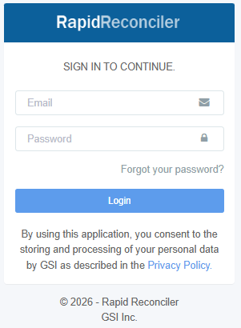
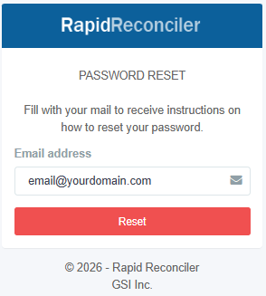

**Rapid Reconciler**

**Training Manual: Getting Started with the Application**

**Section 1: Logging In to the Application**

**1.1 Accessing RapidReconciler**

RapidReconciler is accessible via Google Chrome, Microsoft Edge, or Safari.

Navigate to the RapidReconciler web page:

[Rapid Reconciler](https://rapidreconciler.getgsi.com/)

**Important:** The credentials you have been provided will only work on one of the two links. Choose the appropriate link based on your user type.

**1.2 Entering Your Credentials**

When your Administrator adds you to the RapidReconciler system, you will receive a confirmation email. Your login ID will be the email address used for the confirmation.

To assign or reset your password:

- Click the **"Forgot Your Password?"** link on the login screen.
- Enter your email address on the Password Reset page.
- Click **Reset** to receive instructions for setting your password.

**1.3 Password Requirements**

- Passwords must be reset every 90 days. You will be prompted when your 90-day period has expired.
- GSI has the ability to enable complex passwords for RapidReconciler.
- Contact GSI at **<rrsupport@getgsi.com>** to enable this feature for your company.

 

[Complex Passwords](../MDS/complex-password.md)

---

**Section 2: Navigating the Application**

**2.1 The Web Page Banner**

The banner is the blue bar that runs across the top of the web page. The following controls are available within the banner:

| **Control** | **Description** |
|---|---|
|  **Collapse** | Hides or shows the left-side navigation panel. |
| **Personal Data** | Toggles the display of personal user information. |
| **Log Out** | Ends the current session and logs the user out. |
| **Full Screen** | Expands the application to full screen. |
| **System Alerts** | Displays any active system notifications. |
| **Help Panel** | Toggles the context-sensitive help panel. |

**Recommendation:** Do not log out until your training has been completed.

**2.2 Main Navigation Bar**

The main navigation bar runs along the left side of the browser window. The items visible to each user will depend on the permissions granted by the RapidReconciler Administrator.

The navigation bar contains the following elements:

| **Item** | **Description** |
|---|---|
| **System Data** | Displays the server name and your full name. |
| **Database Drop-Down** | Allows selection of databases you have permission to view (e.g., production, PY, QA). |
| **Import JDE Data** | Launches the job to import JDE data to RapidReconciler. Typically assigned to Administrators only. |
| **Restart Service** | Restarts RapidReconciler data services. Typically assigned to Administrators only. |
| **Inventory** | Perpetual Inventory to General Ledger Reconciliation Module. |
| **In Transit** | Goods In Transit (ST/OT Orders) to General Ledger Reconciliation Module. |
| **PO Receipts** | Received Not Vouchered to General Ledger Reconciliation Module. |
| **Admin** | Administrative functions, such as assigning new users or updating company information. |
| **University** | Links to videos and other collateral to assist in reconciliation processes. All users have access. |

Clicking on Inventory, In Transit, or PO Receipts expands the navigation bar to show additional sub-pages available within each module.

**2.3 Module Status Bar**

The module status bar provides information on your current location within the application and the status of the applicable data. It contains four elements:

- **Page Identifier** - Displays the name of the page you are currently on.
- **Inventory Validation** - A green indicator confirms that the roll-forward from the prior period is accurate. Red indicates a potential issue that must be resolved before making journal entries.
- **System Status** - A green indicator confirms that the JDE import into RapidReconciler completed successfully. Red indicates a potential issue.
- **Period End Selector** - Allows selection of the period to be reconciled (available on applicable modules).

Hovering your cursor over either status indicator displays a pop-up with additional information.

**2.4 Help Panel**

Context-sensitive help is available by clicking the question mark icon at the top right of the web page banner. Help content changes dynamically based on the page currently being viewed, providing relevant guidance without the need to search through external documentation.

---

**Section 3: Preparing to Use the Application**

**3.1 Computer Checklist**

Before beginning, verify that your workstation meets the following minimum requirements:

- A current web browser - Google Chrome, Microsoft Edge, Firefox, or Safari (compatible with Mac as well).
- A minimum of 8 GB of RAM.

**3.2 Troubleshooting: No Data Displayed After Login**

If you are able to log in but no data is displayed, consider the following:

- **Network Connection** - You must be connected to your office network. If working remotely, connect via VPN or another approved method before accessing the application.
- **Reload the Browser** - Use Shift + F5 to perform a hard reload of the browser.
- **Clear Browser Data** - This procedure varies by browser. Contact your IT department for specific instructions.

If none of the above resolves the issue, contact RapidReconciler Support at **<rrsupport@getgsi.com>**.