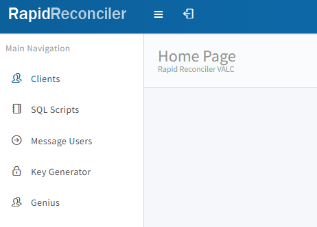
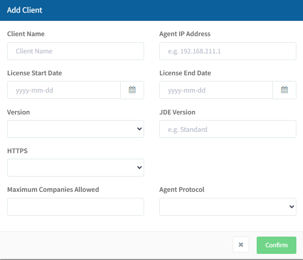
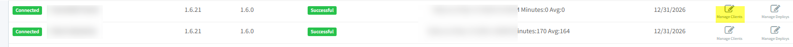
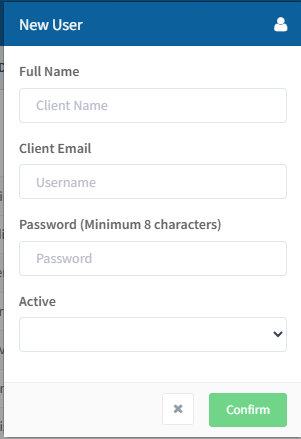
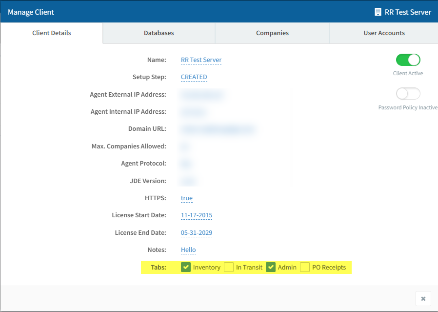
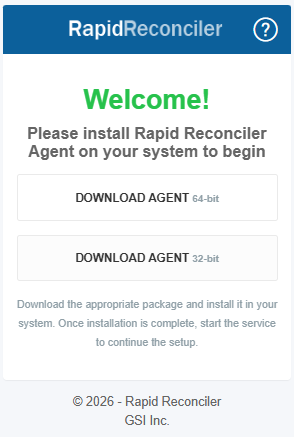

**Installing a Client in VALC (Internal Use Only) **

**Professional Training Guide**

**Overview**

This guide covers the end-to-end process for setting up a new customer in VALC and installing the RapidReconciler Agent on their application server. The process consists of two main phases:

- **Initial VALC Setup** - Creating the client record, initial user account, and module configuration in the VALC portal.
- **RapidReconciler Agent Installation** - Downloading, installing, and validating the agent on the customer's server.

**Prerequisites**

Before beginning, collect the following information from the sales contract or the customer's IT contact:

- Number of companies purchased (per the sales contract)
- Customer name (e.g., Acme Manufacturing)
- IT contact email address and phone number
- JD Edwards version _(optional - for reference only)_

In addition:
1) Ensure you have the necessary permissions to access VALC and perform client setup tasks.
2) Make sure the RapidReconciler_Prod database has been configured and populated.

`[Installing Production Database](../MDS/Installing_production_database.md)`

**Part 1: Initial VALC Setup**

**About VALC**

VALC (Version and Licensing Control) is a GSI-developed web application hosted on Microsoft Azure. It is used to manage RapidReconciler and Genius customers. All new customers must be added to VALC before the installation process can begin.

**Important:** Adding a customer in VALC is performed by GSI staff only. Note that this process will be transitioning to Active Directory control in a future update.

**Login URL:** [Rapid Reconciler VALC](https://rr-valc-spa.cloudapp.net/) Use the login credentials provided to you by GSI.

**Navigating VALC**

VALC contains five main pages accessible from the top navigation:

`

| **Page**                | **Description**                                                        |
| ----------------------- | ---------------------------------------------------------------------- |
| **Clients** _(default)_ | Where RapidReconciler clients are added and maintained                 |
| **SQL Scripts**         | Used to deploy RapidReconciler database updates - _RR developers only_ |
| **Message Users**       | Displays messages to users at login; messages include expiration dates |
| **Genius Pages**    | Two pages are dedicated to Genius customers, including Key Generator.  |

**Step 1 - Create the Client Record**

- Click the Clients page in the main navigation bar.
- Click **Create Client** in the top-right corner.

`

- Complete the form using the following field guidance:

| **Field**                     | **Value**                                                                                                          |
| ----------------------------- | ------------------------------------------------------------------------------------------------------------------ |
| **Client Name**               | Enter the customer's name (e.g., Acme Manufacturing)                                                               |
| **Agent I/P Address**         | Leave blank - populates automatically during agent installation                                                    |
| **License Start Date**        | Today's date                                                                                                       |
| **License End Date**          | Last day of the current calendar year _(must be updated manually each year; users are locked out after this date)_ |
| **Version**                   | Select the latest version from the drop-down (this is the Agent version)                                           |
| **JDE Version**               | Enter the customer's JDE version - informational only                                                              |
| **HTTPS**                     | Select **True** - RapidReconciler requires HTTPS                                                                   |
| **Maximum Companies Allowed** | Enter the number of licenses per the sales contract                                                                |
| **Agent Protocol**            | Select **SSL** - offline functionality is not available                                                            |

- Click **Confirm** to save the record.

**Note:** Once a client record has been created, it cannot be deleted through the application. Use the **inactive** status option if a client needs to be deactivated (e.g., when they opt out of their maintenance agreement).

After confirming, the new client will appear in the grid with the following initial values:

- **Status:** Disconnected _(will update to "Connected" once the RR Agent establishes communication)_
- **Agent Version:** Blank _(populates once the agent connects)_
- **System Status / Messages:** Blank _(populates after database setup is complete and the job runs for the first time)_

`

**Step 2 - Create the Initial User Account**

An initial user account must be created before the agent can be installed.

- Click the **Manage Clients** icon for the newly created client.
- Select the **User Accounts** tab.
- Click **New User** and complete the form as follows:

`

| **Field**        | **Value**                                                             |
| ---------------- | --------------------------------------------------------------------- |
| **Full Name**    | GSI Admin                                                             |
| **Client Email** | <gsiadmin@_clientdomain_.com> (e.g., <rradmin@acmemanufacturing.com>) |
| **Password**     | 12345678                                                              |
| **Active**       | Yes                                                                   |

- Click **Confirm**.

The new user will appear as a row on the User Accounts tab. These credentials will be used during the RR Agent installation.

**Step 3 - Configure Initial Modules**

- Click the **Manage Clients** icon for the client.
- On the Client Details tab under the **Tabs** section, check **Inventory** and **Admin** to start.

**Recommendation:** It is best practice to get the client running on Inventory and Admin before enabling additional modules.

`

The **Setup Step** field will display "Created" at this stage and will cycle through subsequent steps as the installation progresses.

**Part 2: Installing the RapidReconciler Agent**

**Prerequisites**

- You must be logged in on the **customer's application server** to complete this phase.
- Schedule a web meeting with the customer's IT contact before proceeding.
- The **Setup Step** in the client's VALC record must show **"Created"** in order for the agent download prompt to appear.

**Step 1 - Download and Install the Agent**

`

- From the customer's application server, open a web browser and navigate to: **<https://rapidreconciler.getgsi.com>**
- Log in using the user credentials created in VALC (Step 2 above).
- Upon first login, the agent download screen will be displayed.
- Download the appropriate version of the agent. In the vast majority of cases, this will be the **64-bit version**.
- Execute the downloaded file and follow the installation prompts.
- Once installed, the web page will complete the installation automatically. The **"Installation Complete"** message will appear when finished. This process may take several minutes.

**Step 2 - Validate the SQL Server Connection**

After installation, return to the web browser. Within a couple of minutes, the **"Validating Data"** screen will appear, followed by the SQL Server connection properties prompt.

Enter the following details:

| **Field**     | **Value**                                                  |
| ------------- | ---------------------------------------------------------- |
| **Address**   | Internal IP address of the RapidReconciler database server |
| **Port**      | Port for the instance (typically **1433**)                 |
| **User Name** | rruser _(default set during database creation)_            |
| **Password**  | rruser _(default set during database creation)_            |

Once submitted, the browser will display a **"Deploying"** status followed by the **"Installation Complete"** confirmation screen.

**Step 3 - Verify Connectivity in VALC**

Return to your local machine and log in to VALC to confirm the following:

- The client's **Status** has updated to **"Connected"**
- The **Agent Version** field is now populated

**Part 3: Completing the Setup in VALC**

**Verify Database Status**

Navigate to the client's **Database** tab in VALC and confirm that all database statuses show as **Online**.

**License Company Numbers**

Once connectivity is confirmed and the initial data load is complete, the customer's company numbers will become available for licensing.

- Click the **Manage Clients** icon, then select the **Companies** tab.
- Check the applicable company numbers in accordance with the purchase agreement.

**Note:** If more than one RapidReconciler database has been configured for this client, company licensing must be completed for each database separately.