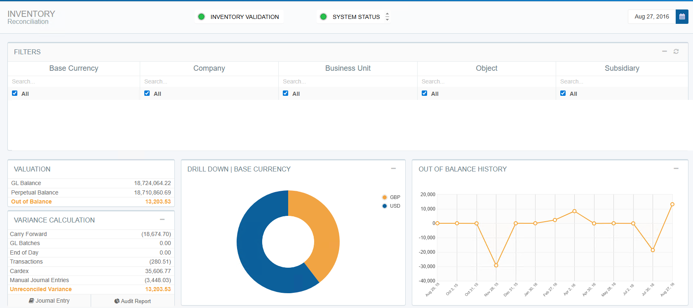
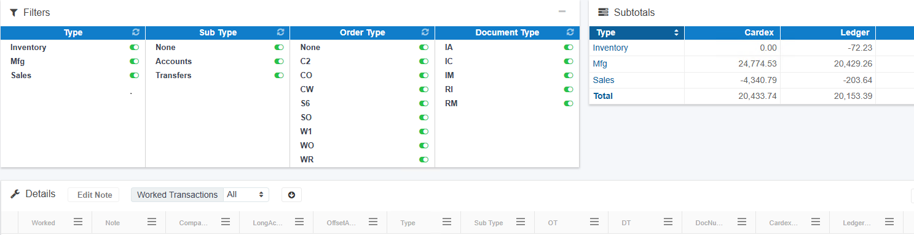
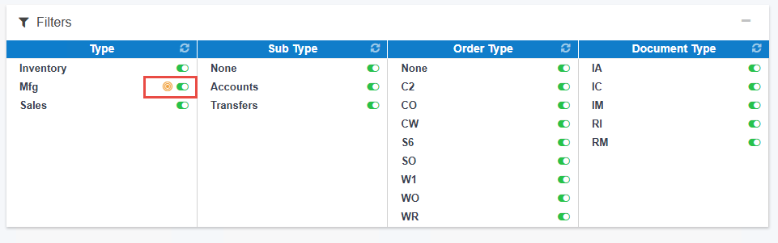
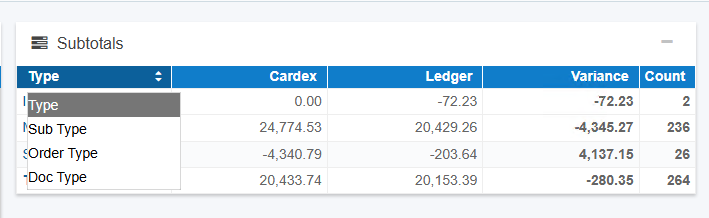
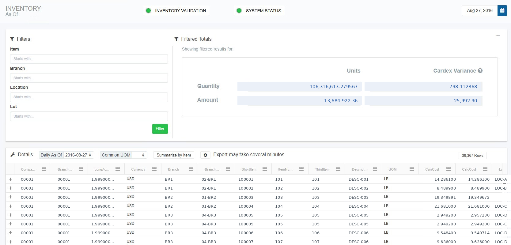
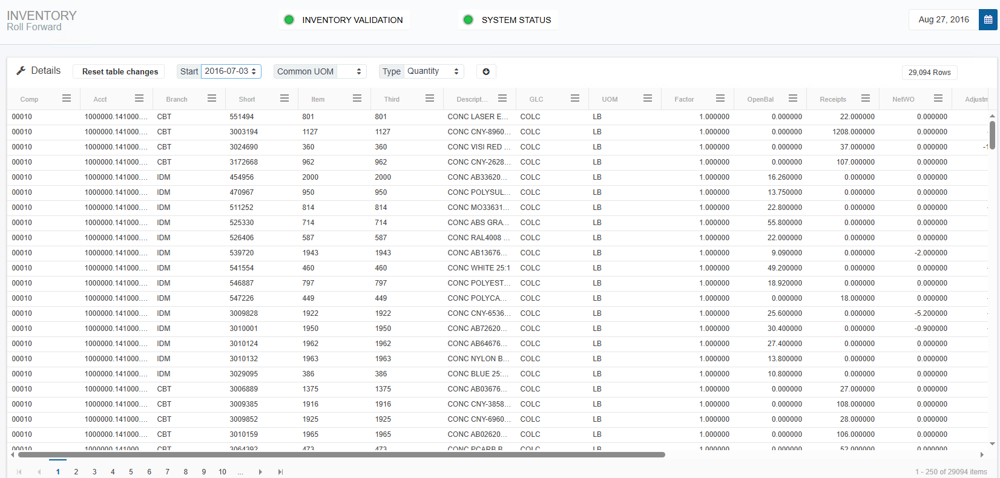
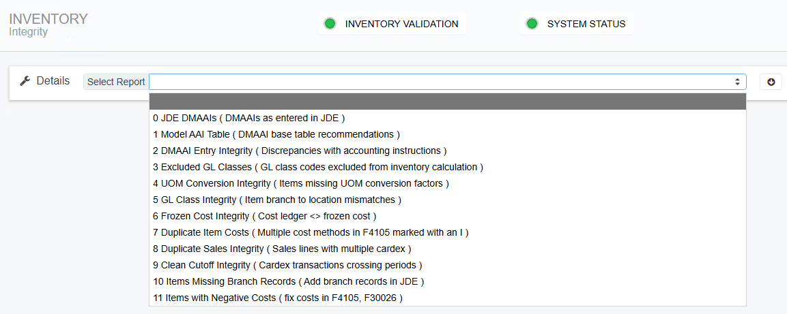

# How to Reconcile Perpetual Inventory Using RapidReconciler

## A Complete Guide to the Inventory Module

---

## Table of Contents

- [Overview](#overview)
- [Before You Begin](#before-you-begin)
- [Section 1: The Reconciliation Page](#section-1-the-reconciliation-page)
- [Section 2: Valuation Section](#section-2-valuation-section)
- [Section 3: Variance Calculation -- Understanding and Resolving Each Source](#section-3-variance-calculation----understanding-and-resolving-each-source)
- [Section 4: Supporting Widgets and Reports](#section-4-supporting-widgets-and-reports)
- [Section 5: Inventory Transactions Page](#section-5-inventory-transactions-page)
- [Section 6: Inventory As-Of Page](#section-6-inventory-as-of-page)
- [Section 7: Inventory Roll Forward Page](#section-7-inventory-roll-forward-page)
- [Section 8: Integrity Reports](#section-8-integrity-reports)
- [Section 9: Step-by-Step Reconciliation Workflow](#section-9-step-by-step-reconciliation-workflow)
- [Section 10: Related Documentation](#section-10-related-documentation)

---

## Overview

Reconciling perpetual inventory to the general ledger is one of the most time-consuming and error-prone tasks in a JD Edwards environment. RapidReconciler automates the comparison of item ledger (F4111) data against the GL account balance (F0902), surfaces all sources of variance in a single view, and provides the tools to investigate and resolve each one.

This guide walks through the full reconciliation process using RapidReconciler -- from logging in and selecting the correct period through closing activities, journal entries, and integrity report review.

**What RapidReconciler reconciles:**

| Module | What Is Reconciled | Key Tables |
|---|---|---|
| **Inventory** | Perpetual item ledger balance vs. General Ledger | F4111 vs. F0902 / F0911 |
| **In Transit** | Goods in transit (ST/OT orders) vs. General Ledger | F43121 vs. F0902 / F0911 |
| **PO Receipts** | Received Not Vouchered balance vs. General Ledger | F43121 vs. F0902 / F0911 |

This guide covers the **Inventory module** specifically. For In Transit and PO Receipts reconciliation, see the related documentation in Section 10.

### How RapidReconciler Helps

The traditional approach to inventory reconciliation in JD Edwards relies on running a Stock Status report and comparing it to the trial balance -- a process with five well-documented failure points: timing, backdating, report definition errors, DMAAI misconfiguration, and GL class code changes. Each of these can produce a mismatch that takes hours to trace manually and recurs every period if the root cause is not identified and corrected.

RapidReconciler replaces the point-in-time report comparison with a continuous, automated reconciliation that is updated with every nightly import:

| RapidReconciler Feature | How It Helps |
|---|---|
| **Valuation Section** | Compares the summarized F4111 perpetual balance to the F0902 GL balance automatically for every period, eliminating the need to run and compare two separate JD Edwards reports. |
| **Variance Calculation Section** | Breaks the total out-of-balance amount into six specific sources -- Carry Forward, GL Batches, End of Day, Transactions, Cardex, and Manual Journal Entries -- so each can be addressed with the correct corrective action rather than treating the total as one unexplained number. |
| **Transactions Page** | Identifies individual documents where the item ledger (F4111) does not match the GL (F0911), surfaces the specific matching field that differs, and provides full drill-down to the DMAAI setup responsible for the mismatch. |
| **As-Of Page** | Provides a period-end inventory position by item, branch, location, and lot, with cardex transaction detail and variance indicators (QtyVar, AmtVar) at the item level. Replaces the Stock Status report with a continuously maintained view that is not dependent on report timing. |
| **Cardex Integrity Pop-Up** | Automatically compares summarized F4111 to F41021 for every item on every import cycle, surfaces only the items with variances, and distinguishes between quantity issues (requiring IT intervention) and dollar-only issues (requiring a dollars-only IA adjustment). |
| **Integrity Reports 2--6** | Proactively identify DMAAI mismatches, excluded GL class codes, UOM conversion gaps, GL class code inconsistencies between item branch and location records, and frozen cost discrepancies -- the configuration issues that silently cause reconciling variances -- before they accumulate into large period-end problems. |
| **Audit Report** | Produces a complete period-end reconciliation record including account summaries, unposted batches, open orders, manual entries, transaction variances, and perpetual detail -- all in a single exportable document for audit and internal review. |

> **Key principle:** RapidReconciler does not correct inventory data -- all corrections are made in JD Edwards. RapidReconciler's role is to identify what is out of balance, exactly where the discrepancy originates, and what the correct corrective action is -- so the period-end close becomes a confirmation of an already-understood position rather than a discovery exercise.

> **Important:** RapidReconciler data is refreshed nightly. Transactions entered in JD Edwards after the most recent import will not appear until the following night's refresh. Both status lights on the Reconciliation page must be **green** before making any adjustments to the general ledger.

---

## Before You Begin

### Prerequisites

| Item | Requirement |
|---|---|
| **Access** | Login credentials provided by your RapidReconciler administrator |
| **Browser** | Google Chrome, Microsoft Edge, Firefox, or Safari |
| **Network** | Connected to your office network or VPN |
| **JD Edwards access** | Required to investigate and correct issues identified in RapidReconciler |
| **Permissions** | Confirm with your administrator which companies and accounts you have permission to view |

### Understanding the Data Source

RapidReconciler does not modify JD Edwards data. It reads from JD Edwards tables in **read-only** mode and calculates the reconciliation position based on imported data. All corrections are made in JD Edwards; RapidReconciler reflects those corrections after the next nightly refresh.

The key tables RapidReconciler reads for inventory reconciliation are:

| Table | Description |
|---|---|
| **F4111** | Item Ledger -- all inventory transactions |
| **F41021** | Item Location -- on-hand balances |
| **F0902** | Account Balances -- GL period-end balances |
| **F0911** | Account Ledger -- GL transaction detail |
| **F4095** | Distribution/Manufacturing AAI Values |
| **F4101 / F4102** | Item Master / Item Branch |

For a full table listing, see the [Technical Requirements Guide](../MDS/tech-requirements.md).

---

## Section 1: The Reconciliation Page

### 1.1 Overview

The Reconciliation page is the default page displayed upon login. This is where all variance sources are summarized and where the majority of reconciliation work is performed.

### 1.2 Status Indicators

Two status indicators appear at the top center of the screen. **Both must be green before making any adjustments to the general ledger.**

| Indicator | Green Means | Red Means | Action if Red |
|---|---|---|---|
| **Inventory Validation** | The carry-forward from the prior period is accurate | A potential issue exists -- typically an unposted batch | Hover over the indicator for details; resolve the prior period before proceeding |
| **System Status** | The JD Edwards import completed successfully | The import encountered an error | Hover over the indicator for details; contact your administrator |

> **Note:** If the System Status light is **flashing yellow**, the JD Edwards import is still in progress. Wait for it to complete before reviewing data.

### 1.3 Period Selector

The period selector is located in the top right corner. Key behaviors:

- Periods displayed depend on the reconciliation start date configured by your administrator.
- New periods are automatically added as new cardex transactions are entered in JD Edwards.
- The period selection persists as you navigate across pages within the inventory module.
- If more than 14 periods of data exist, a purge is recommended. Contact your administrator.

### 1.4 Account Filters

The account filters operate as a hierarchy from left to right (Company → Business Unit → Object → Subsidiary):

- Check items to include; uncheck to exclude.
- Removing a company automatically removes its associated business units, objects, and subsidiaries.
- Use the search row at the top of each column to filter within that column.
- Filter selections persist across pages within the inventory module.
- If display issues occur, click the refresh icon in the top right corner.

---

## Section 2: Valuation Section

The Valuation section provides a quick confirmation of whether the perpetual inventory balance matches the GL balance for the selected period and filter set.

| Field | Description | Source |
|---|---|---|
| **GL Balance** | The general ledger balance for the selected accounts and period | F0902 -- should match the trial balance exactly |
| **Perpetual Balance** | A summarized cardex total calculated from RapidReconciler's balance forward records | F4111 summarized |
| **Out of Balance** | The difference between GL Balance and Perpetual Balance | If zero, inventory is fully reconciled |

> **If the Out of Balance amount is zero**, inventory reconciles to the GL for the selected period and filters. No further action is required for this period.

> **If the Out of Balance amount is non-zero**, proceed to Section 3 to identify and resolve each source of variance.

**Understanding why these numbers might differ:** The five most common root causes of a GL vs. perpetual mismatch are timing, backdating, report definition issues, DMAAI configuration errors, and GL class code changes. For a full explanation, see the [Stock Status and Trial Balance Reconciliation Guide](../MDS/stock-status-trial-balance.md).

---

## Section 3: Variance Calculation -- Understanding and Resolving Each Source

The Variance Calculation section lists every source of variance. The sum of all variances equals the Out of Balance amount in the Valuation section. Each non-zero line requires attention.

### 3.1 Carry Forward

**What it is:** The out-of-balance amount carried forward from the prior period.

**Why it occurs:** A variance existed in the prior period that was not fully resolved before closing.

**How to resolve:**
- Return to the prior period and resolve the underlying issue.
- If the prior period is closed and the variance is immaterial, include it in the current period's manual journal entry.
- Document the decision and amount for audit purposes.

### 3.2 GL Batches

**What it is:** Entries in the GL detail table F0911 where the posted code is not "P" -- meaning the batch has not been posted.

**Why it occurs:** Batches may be left unposted due to approval holds, errors during posting, or missing batch headers.

**How to resolve:**
- Work with the finance department to identify and post the unposted batches.
- A **bell icon** on the GL Batches row indicates unposted batches more than 2 days old -- these require immediate attention.
- If a batch header cannot be located, run the JD Edwards "Missing Batch Header" report. The header must be rebuilt and the batch reposted to clear the entry.

> **Note:** GL Batches must be zero before performing closing activities. Do not proceed to Step 3 of the reconciliation workflow until this line is clear.

### 3.3 End of Day

**What it is:** Item ledger records (F4111) that do not yet contain a batch number or GL date.

**Why it occurs:** Ship confirmations, material issues, and work order completions generate item ledger records that initially have no batch number. These are populated when Sales Update (R42800) or Manufacturing Accounting (R31802A) is run -- typically nightly.

**How to resolve:**
- A **bell icon** indicates open orders more than 2 days old -- investigate why Sales Update or Manufacturing Accounting has not processed these orders.
- Confirm that Sales Update and Manufacturing Accounting batch jobs are scheduled and completing successfully.
- If orders have been stuck for an extended period, investigate with IT.

> **Note:** End of Day must be zero before performing closing activities. For more on Sales Update, see the [Sales Order Reference Guide](../MDS/sales_order_reference.md).

### 3.4 Transactions

**What it is:** The difference in amounts between an item ledger transaction and its corresponding GL entry, where the two do not match based on company number, account number, fiscal period, document type, document number, order number, and batch number.

**Why it occurs:** Common causes include DMAAI misconfiguration (the cardex and GL are posting to different accounts), fiscal period mismatches (backdating), intercompany settlements posting to unexpected accounts, and direct ship order handling.

**How to resolve:**
- Navigate to the Transactions page (Section 5) to drill into specific transactions.
- For each mismatched transaction, determine the root cause using the Transaction Detail report.
- The corrective action is always an **offsetting manual journal entry in JD Edwards** -- the transaction itself has already been completed and cannot be changed.
- Enter a note in RapidReconciler for each resolved transaction for audit purposes.

> **For DMAAI-related mismatches:** See the [DMAAI Reference Guide](../MDS/dmaai-reference-guide.md). For GL class code mismatches: see [GL Class Code Management](../MDS/gl-class-code-changes.md).

### 3.5 Cardex

**What it is:** Items where the summarized cardex (F4111) does not match the on-hand balance in the Item Location table (F41021).

**Two types of cardex variance exist:**

| Variance Type | Description | Resolution |
|---|---|---|
| **Quantity variance** | The summed F4111 quantity differs from F41021 | Requires an IT SQL correction -- this cannot be resolved through normal JD Edwards transactions |
| **Amount variance** | The summed F4111 extended amount differs from the F41021 value | Requires a dollars-only IA adjustment in JD Edwards -- see the [Cardex Integrity Variance Guide](../MDS/dollars-only-adjustment.md) |

> **Important:** Use the Cardex Integrity pop-up in RapidReconciler to identify which items have variances and what type. Always validate against JD Edwards before taking corrective action. For the full procedure, see the [Cardex Integrity Variance Guide](../MDS/dollars-only-adjustment.md).

### 3.6 Manual Journal Entries

**What it is:** Any manual entries made directly to the inventory GL account(s) to correct out-of-balance amounts.

**Note:** Manual journal entries made to the inventory account appear here so they are visible in the reconciliation. This line confirms that manual entries have been accounted for in the overall variance calculation.

---

## Section 4: Supporting Widgets and Reports

### 4.1 Drill Down Widget

A visual aid for identifying where the largest variances exist, especially useful in multi-company environments.

- The chart follows the account filter hierarchy, starting at currency code level.
- Hovering over a chart section displays the item name and variance amount.
- Clicking a section drills down to the next level; the back arrow returns to the previous level.
- Filter selections automatically update as you click through levels.
- If there is no variance, no chart is displayed.

### 4.2 Offset Account Widget

The Offset Account widget (star icon) appears when hovering over the End of Day or Transactions rows. Clicking it opens a pop-up listing the company, period, inventory account, and suggested offset account for the applicable variance. The data can be exported to Excel for use in the JD Edwards journal entry screen.

**Exported data structure:**
- **je_account column** -- One row for the inventory side, one for "Tolerance Adjust," and one or more for remaining variance
- **Tolerance Adjust** -- Rounding amounts below 1 monetary unit that still require adjustment
- **TBD** -- Default placeholder for variance rows where no offset account has been configured

> **After exporting:** Replace "Tolerance Adjust" and "TBD" with the applicable GL account numbers, then copy the two rightmost columns and paste into JD Edwards. This tool is designed for use during the period-end close -- entries made mid-period are not reflected.

### 4.3 Out of Balance History Graph

Displays variance trends over the most recent 14 periods. Useful for identifying whether variances are recurring or period-specific.

- Hovering over a period displays the date and variance total.
- Clicking a data point changes the period filter to that period end date.
- A system in perfect balance shows all periods at $0.

### 4.4 Journal Entry Button

Produces an Excel report of the GL and perpetual balances for the selected accounts and period. Used for account-level journal entries when detailed transaction review is not required.

### 4.5 Audit Report

The Audit Report documents the complete reconciliation results for the period. **Produce and save this report at the end of every period** -- detail data may be removed during a purge.

| Section | Contents |
|---|---|
| **Accounts Summary** | Valuation and variance calculation summary for each account |
| **Unposted GL Batches** | Details for any remaining unposted batches |
| **End of Day** | Remaining work orders or sales orders awaiting processing |
| **Manual Journal Entries** | All manual entries made to the account |
| **Variances** | Transaction variances for the period, including any user-entered notes |
| **Perpetual Details** | Item balances and values at the end of the selected period |

Output format: Excel or PDF.

---

## Section 5: Inventory Transactions Page

### 5.1 Overview

The Transactions page lists documents where the item ledger (F4111) does not match the GL (F0911) based on the matching criteria. Only reconciling items are displayed -- internally reconciled transactions do not appear.

### 5.2 Rounding and Tolerance

Transactions that differ by less than 1 monetary unit are not displayed by default to prevent small rounding differences from obscuring significant variances. These sub-tolerance amounts are still counted in the Transactions line of the Variance Calculation section.

> The tolerance setting can be changed by the RapidReconciler administrator if greater precision is required.

### 5.3 Filters

| Filter | Options |
|---|---|
| **Type** | Inventory, Sales, Manufacturing, or Purchasing |
| **Sub Type** | Accounts (account number mismatch), Periods (fiscal period mismatch), Transfers, Intercompany, Direct Ship, Voucher Variance |
| **Order Type** | The JD Edwards order type |
| **Document Type** | The JD Edwards document type |

***Filter Widget Tips:***

Use the **Filters** widget to isolate specific transaction types:

- **Target icon**: Click the target icon next to any filter value to display only that value and hide all others in that category. For example, click the target next to "Sales" to show only sales transactions and hide Inventory, Manufacturing, and Purchasing entries.
- **Toggle switch**: Click the toggle next to any filter value to turn it on or off independently, without affecting other selections. For example, click the target for "Sales," then toggle "Inventory" back on to view both sales and inventory transactions together.

***Subtotals Widget Tips:***

The **Type** column of the **Subtotals Filter** has a dropdown filter that can be used to summarize totals by type, sub type, order type or document type:

### 5.4 Transaction Detail Report

Click the **+** icon at the left of any row to expand the transaction detail. The green icon on the left will export the detail data to Excel. The report is organized into six sections:

| Section | Description |
|---|---|
| **Section 1 -- Unassigned Account** | Cardex transactions with a GL class code not in the model DMAAI table. Stock items must be added to the model. |
| **Section 2 -- F4111 Cardex** | All F4111 rows for the selected company, document type, and document number |
| **Section 3 -- F0911 GL** | All F0911 rows for the selected company, document type, and document number |
| **Section 4 -- RapidReconciler** | How RapidReconciler matches and summarizes the data. One row = match; multiple rows = mismatch |
| **Section 5 -- Order Data** | For PO receipts and sales shipments, all lines for the associated order. For intercompany orders, includes related order information. |
| **Section 6 -- DMAAIs** | All DMAAI entries for each GL class code in the transaction. First row is from the model table. |

**Tips for analysis:**
- Verify that company number, account number, and period ending date match across Sections 2 and 3.
- For single-sided IT transfers, the cardex shows only the "from" side -- the GL will net to $0.
- If account numbers differ between Sections 2 and 3, consult the DMAAI setup in Section 6.
- For more on DMAAI configuration: see the [DMAAI Reference Guide](../MDS/dmaai-reference-guide.md).

> **Corrective action for all Transactions page items:** An offsetting journal entry in JD Edwards, plus a note entry in RapidReconciler for audit documentation.

---

## Section 6: Inventory As-Of Page

### 6.1 Overview

The As-Of page provides a detailed listing of all branch plants, items, lots, and locations for the selected companies and accounts. It serves as the supporting detail for the perpetual balance in the Valuation section.

**Important notes:**
- Amounts are calculated by summarizing F4111 records from the balance forward set at installation -- they are not a snapshot of item balances multiplied by unit costs.
- Items may appear with a value but no quantity. This is expected -- it is why JD Edwards has a zero balance adjustment process built into certain inventory transactions. See the [Zero Balance Adjustments Guide](../MDS/zero-balance-adjustments.md).
- If **-9999** appears in the Quantity on Hand column, a UOM conversion factor is missing. See Integrity Report 4.

### 6.2 GL Class Code Changes and the As-Of Page

Changing a GL class code without the proper adjustment procedure will result in multiple rows on the As-Of grid for the same item. The correct procedure is:

1. Adjust inventory to zero under the original GL class code
2. Change the code at all hierarchy levels (item branch, item location, open orders)
3. Adjust inventory back in under the new GL class code

For the complete procedure, see the [GL Class Code Management Guide](../MDS/gl-class-code-changes.md).

### 6.3 Key Grid Columns

| Column | Description |
|---|---|
| **CurrCost** | Current item cost from the cost ledger. Same value regardless of period selected. |
| **CalcCost** | Calculated cost = Amount / Quantity on Hand. Zero if no quantity. |
| **QtyVar** | Quantity variance between summarized F4111 and item balance F41021 |
| **AmtVar** | Amount variance between summarized F4111 extended cost and on-hand amount |

### 6.4 Key Features

| Feature | Description |
|---|---|
| **Daily As-Of drop-down** | View inventory as of any individual day within the selected period. Clear before comparing to the Reconciliation page perpetual total. |
| **Common UOM** | Restates quantities across all items in a single unit of measure |
| **Summarize by Item** | Collapses location/lot detail to branch/item level, netting offsetting positive and negative quantities |
| **Cardex Transaction Details** | Click the **+** icon to expand individual transactions for any row. Exportable to Excel. |

---

## Section 7: Inventory Roll Forward Page

The admin-configurable Roll Forward report is designed to provide visibility into item activity within a specified date range. It is not part of the standard reconciliation process but can be used for informational purposes or to support specific investigations.
Reference the administrator guide for configuration details. [Administrator Responsibilities](../MDS/admin-responsibilities.md)

The Roll Forward page lists item activity within a specified date range, with document and order types assigned to report columns by the administrator. This is an informational report and is not part of the standard reconciliation process.

**To validate the Roll Forward report:** Review the Variance column on the far right. Any non-zero value indicates a document or order type may be missing from the report configuration. Contact the administrator to review.

---

## Section 8: Integrity Reports

Integrity reports identify JD Edwards configuration issues that will cause reconciling items if not corrected. Review and act on these reports when RapidReconciler is first installed, and then **monthly** as part of the period-end process.

| Report | Name | Monthly Review? | Purpose |
|---|---|---|---|
| **Report 0** | JDE DMAAs | No -- debugging only | Analyze DMAAI configuration. Used when investigating Transactions page items. |
| **Report 1** | Model AAI Table | Before GL adjustments | Lists DMAAI table 4152 entries used to assign GL accounts to item ledger transactions. Must be accurate before making GL adjustments. |
| **Report 2** | DMAAI Entry Integrity | **Yes** | Compares model table entries to other balance sheet DMAAI tables. Identifies business unit, object, and subsidiary mismatches and net-zero accounts. See [DMAAI Reference Guide](../MDS/dmaai-reference-guide.md). |
| **Report 3** | Excluded GL Classes | **Yes** | Lists items whose GL class code is not in model DMAAI table 4152. Values for these items are excluded from the reconciliation. See [GL Class Code Management Guide](../MDS/gl-class-code-changes.md). |
| **Report 4** | UOM Conversion Integrity | **Yes** | Identifies items with transaction UOMs that differ from the primary UOM where no conversion factor exists. Causes -9999 in the As-Of quantity column. Add direct conversions in JD Edwards to resolve. |
| **Report 5** | GL Class Integrity | **Yes** | Lists items where the GL class on the item branch (F4102) does not match one or more location records (F41021). Correct in JD Edwards. See [GL Class Code Management Guide](../MDS/gl-class-code-changes.md). |
| **Report 6** | Frozen Cost Integrity | **Yes** | Lists items where the frozen cost in F30026 does not match the method 07 ledger cost in F4105. Resolve by re-rolling the cost in JD Edwards. Equivalent to running R30543. See [Product Costing Reference Guide](../MDS/product-costing-reference.md). |
| **Report 7** | Duplicate Item Costs | When alerted | Lists items with more than one cost method designated as the Inventory valuation cost. Causes the import to fail. An alert is sent at login. Correct in JD Edwards immediately. |
| **Report 8** | Duplicate Sales Integrity | When items appear | Lists sales lines appearing in F4111 more than once. Typically caused by system failures during Sales Update. Correct via cycle count and manual journal entry. Contact rrsupport@getgsi.com for assistance. |
| **Report 9** | Clean Cutoff Integrity | Informational | Lists items where the cardex creation period does not match the GL date period. Identifies accrual opportunities. No corrective action required -- review for process improvement. |
| **Report 10** | Items Missing Branch Records | When items appear | Lists items with F41021 quantity but no F4102 branch record. Severe data integrity issue. Contact IT immediately. |

---

## Section 9: Step-by-Step Reconciliation Workflow

### 9.1 Frequency Guidance

| Activity | Recommended Frequency |
|---|---|
| Steps 1 and 2 (select data, evaluate variances) | Daily or weekly, based on business needs |
| Steps 3 and 4 (closing activities, integrity reports) | Period-end close |

### 9.2 Step 1 -- Select the Applicable Data Set

1. Log in to RapidReconciler at [https://rapidreconciler.getgsi.com](https://rapidreconciler.getgsi.com)
2. Confirm both status lights are **green**. Do not proceed if either is red.
3. Select the period to be reconciled using the period selector (top right).
4. Apply the appropriate company and account filters.

### 9.3 Step 2 -- Evaluate the Variance Calculation

Review the Valuation section. If the Out of Balance amount is zero, inventory is fully reconciled -- no further action is required. If non-zero, review each variance source:

| Variance Source | Bell Icon Meaning | Immediate Action |
|---|---|---|
| **Carry Forward** | N/A | Return to prior period, or include in current period manual entry |
| **GL Batches** | Unposted batches > 2 days old | Contact finance; post outstanding batches |
| **End of Day** | Open orders > 2 days old | Investigate why Sales Update or Manufacturing Accounting has not processed |
| **Transactions** | N/A | Navigate to Transactions page; prepare offsetting journal entries |
| **Cardex** | N/A | Open Cardex Integrity pop-up; follow the [Cardex Integrity Variance Guide](../MDS/dollars-only-adjustment.md) |

### 9.4 Step 3 -- Perform Closing Activities

Before closing a period, confirm:

- [ ] GL Batches variance = **$0**
- [ ] End of Day variance = **$0**
- [ ] Transaction variances reviewed and journal entries prepared
- [ ] Carry-forward amount accounted for in the manual entry if applicable

**To post the closing journal entry:**

- Use the **Journal Entry button** for account-level amounts.
- Use the **Offset Account widget** (star icon) for transaction-level amounts (if configured).
- Export the data to Excel, replace any "TBD" placeholders with the correct accounts, and enter in JD Edwards.

After posting, refresh RapidReconciler data (next nightly import) and confirm the Out of Balance amount is zero.

**Produce the Audit Report** and save it to a dedicated folder for the period being closed.

### 9.5 Step 4 -- Review Integrity Reports

As part of the period-end close, review Integrity Reports 2 through 6 and resolve any items identified:

- **Report 2** -- DMAAI Entry Integrity: Correct mismatched AAI entries in JD Edwards
- **Report 3** -- Excluded GL Classes: Add missing GL class codes to the model table or investigate why the item should be excluded
- **Report 4** -- UOM Conversion Integrity: Add missing conversion factors in JD Edwards
- **Report 5** -- GL Class Integrity: Correct GL class code mismatches between item branch and location records
- **Report 6** -- Frozen Cost Integrity: Re-roll costs for items with F30026 / F4105 mismatches

> Items on these reports will clear automatically after the next nightly refresh once the underlying JD Edwards data is corrected.

---

## Section 10: Related Documentation

| Document | Relevance |
|---|---|
| [Stock Status and Trial Balance Reconciliation](../MDS/stock-status-trial-balance.md) | Explains the five root causes of inventory vs. GL discrepancies |
| [Cardex Integrity Variance Guide](../MDS/dollars-only-adjustment.md) | Full procedure for resolving cardex variances including dollars-only adjustments and Re-Roll options |
| [DMAAI Reference Guide](../MDS/dmaai-reference-guide.md) | Complete reference for AAI configuration including Integrity Report 2 analysis |
| [GL Class Code Management Guide](../MDS/gl-class-code-changes.md) | Procedures for changing GL class codes and understanding Integrity Reports 3 and 5 |
| [Product Costing Reference Guide](../MDS/product-costing-reference.md) | Standard cost, weighted average, and actual cost setup including Integrity Report 6 |
| [Zero Balance Adjustments Guide](../MDS/zero-balance-adjustments.md) | Explains system-generated IB adjustments visible in the As-Of page |
| [Item Ledger and Cardex Analysis Guide](../MDS/item-ledger-faq.md) | F4111 table structure, posting codes, and cardex analysis techniques |
| [Sales Order Reference Guide](../MDS/sales_order_reference.md) | Sales Update (R42800) processing -- resolves End of Day variances from sales orders |
| [Transfer Order Reference Guide](../MDS/transfer_order_reference.md) | ST/OT transfer order accounting and In Transit reconciliation |
| [Getting Started with RapidReconciler](../MDS/getting-started-with-rapidreconciler.md) | Login, navigation, and first-time setup |
| [Technical Requirements](../MDS/tech-requirements.md) | Server, browser, and JD Edwards connection requirements |