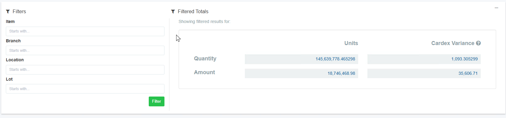
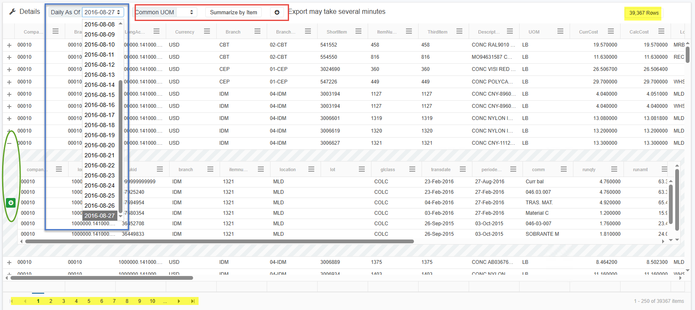

# How to Reconcile Perpetual Inventory Using RapidReconciler

## A Complete Guide to the Inventory Module

---

## Table of Contents

- [Overview](#overview)
- [Before You Begin](#before-you-begin)
- [Section 1: The Reconciliation Page](#section-1-the-reconciliation-page)
- [Section 2: Valuation Section](#section-2-valuation-section)
- [Section 3: Variance Calculation — Understanding and Resolving Each Source](#section-3-variance-calculation--understanding-and-resolving-each-source)
- [Section 4: Supporting Widgets and Reports](#section-4-supporting-widgets-and-reports)
- [Section 5: Inventory Transactions Page](#section-5-inventory-transactions-page)
- [Section 6: Inventory As-Of Page](#section-6-inventory-as-of-page)
- [Section 7: Inventory Roll Forward Page](#section-7-inventory-roll-forward-page)
- [Section 8: Integrity Reports](#section-8-integrity-reports)
- [Section 9: Step-by-Step Reconciliation Workflow](#section-9-step-by-step-reconciliation-workflow)
- [Section 10: Related Documentation](#section-10-related-documentation)

---

## Overview

Reconciling perpetual inventory to the general ledger is one of the most time-consuming tasks in a JD Edwards environment. RapidReconciler automates the comparison of item ledger (F4111) data against the GL account balance (F0902), surfaces all sources of variance in a single view, and provides the tools needed to investigate and resolve each one.

This guide covers the full reconciliation process — from selecting the correct period through closing activities, journal entries, and integrity report review.

**What RapidReconciler reconciles:**

| Module | What Is Reconciled | Key Tables |
|---|---|---|
| **Inventory** | Perpetual item ledger balance vs. General Ledger | F4111 vs. F0902 / F0911 |
| **In Transit** | Goods in transit (ST/OT orders) vs. General Ledger | F43121 vs. F0902 / F0911 |
| **PO Receipts** | Received Not Vouchered balance vs. General Ledger | F43121 vs. F0902 / F0911 |

This guide covers the **Inventory module** only. For In Transit and PO Receipts, see Section 10.

### How RapidReconciler Helps

The traditional approach to inventory reconciliation relies on running a Stock Status report and comparing it to the trial balance. This process has five well-documented failure points: timing, backdating, report definition errors, DMAAI misconfiguration, and GL class code changes — any of which can produce a mismatch that takes hours to trace and recurs every period if the root cause is not addressed.

RapidReconciler replaces that point-in-time comparison with a continuous, automated reconciliation updated with every nightly import:

| Feature | How It Helps |
|---|---|
| **Valuation Section** | Automatically compares the summarized F4111 perpetual balance to the F0902 GL balance for every period, eliminating the need to run and manually compare two separate JDE reports. |
| **Variance Calculation Section** | Breaks the total out-of-balance amount into six specific sources — Carry Forward, GL Batches, End of Day, Transactions, Cardex, and Manual Journal Entries — so each can be addressed with the correct corrective action. |
| **Transactions Page** | Identifies individual documents where F4111 does not match F0911, shows which matching field differs, and provides full drill-down to the DMAAI setup responsible for the mismatch. |
| **As-Of Page** | Shows period-end inventory position by item, branch, location, and lot, with cardex transaction detail and variance indicators at the item level. Replaces the Stock Status report with a continuously maintained view that is independent of report timing. |
| **Cardex Integrity Pop-Up** | Compares summarized F4111 to F41021 for every item on every import cycle, surfaces only items with variances, and distinguishes between quantity issues (requiring IT intervention) and dollar-only issues (requiring a dollars-only IA adjustment). |
| **Integrity Reports 2–6** | Proactively identify DMAAI mismatches, excluded GL class codes, UOM conversion gaps, GL class code inconsistencies, and frozen cost discrepancies before they accumulate into large period-end problems. |
| **Audit Report** | Produces a complete period-end reconciliation record — account summaries, unposted batches, open orders, manual entries, transaction variances, and perpetual detail — in a single exportable document for audit and internal review. |

> **Key principle:** RapidReconciler does not correct inventory data — all corrections are made in JD Edwards. RapidReconciler identifies what is out of balance, where the discrepancy originates, and what the correct corrective action is, so period-end close becomes a confirmation of an already-understood position rather than a discovery exercise.

> **Important:** RapidReconciler data is refreshed nightly. Transactions entered in JD Edwards after the most recent import will not appear until the following night. Both status lights on the Reconciliation page must be **green** before making any adjustments to the general ledger.

---

## Before You Begin

### Prerequisites

| Item | Requirement |
|---|---|
| **Access** | Login credentials provided by your RapidReconciler administrator |
| **Browser** | Google Chrome, Microsoft Edge, Firefox, or Safari |
| **Network** | Connected to your office network or VPN |
| **JD Edwards access** | Required to investigate and correct issues identified in RapidReconciler |
| **Permissions** | Confirm with your administrator which companies and accounts you have access to |

### Understanding the Data Source

RapidReconciler reads JD Edwards data in **read-only** mode. It does not modify JD Edwards in any way. All corrections are made in JD Edwards and are reflected in RapidReconciler after the next nightly refresh.

The key tables used for inventory reconciliation are:

| Table | Description |
|---|---|
| **F4111** | Item Ledger — all inventory transactions |
| **F41021** | Item Location — on-hand balances |
| **F0902** | Account Balances — GL period-end balances |
| **F0911** | Account Ledger — GL transaction detail |
| **F4095** | Distribution/Manufacturing AAI Values |
| **F4101 / F4102** | Item Master / Item Branch |

For a full table listing, see the [Technical Requirements Guide](../MDS/tech-requirements.md).

---

## Section 1: The Reconciliation Page

### 1.1 Overview

The Reconciliation page is the default page displayed after login. It summarizes all variance sources and is where most reconciliation work is performed.

### 1.2 Status Indicators

Two status indicators appear at the top center of the screen. **Both must be green before making any adjustments to the general ledger.**

| Indicator | Green | Red | Action if Red |
|---|---|---|---|
| **Inventory Validation** | The carry-forward from the prior period is accurate | A potential issue exists, typically an unposted batch | Hover over the indicator for details; resolve the prior period before proceeding |
| **System Status** | The JD Edwards import completed successfully | The import encountered an error | Hover over the indicator for details; contact your administrator |

> **Note:** A **flashing yellow** System Status light means the JD Edwards import is still in progress. Wait for it to complete before reviewing data.

### 1.3 Period Selector

The period selector is located in the top right corner.

- Periods displayed are determined by the reconciliation start date configured by your administrator.
- New periods are added automatically as new cardex transactions are entered in JD Edwards.
- The selected period persists as you navigate between pages within the inventory module.
- If more than 14 periods of data exist, a purge is recommended — contact your administrator.

### 1.4 Account Filters

The account filters work as a left-to-right hierarchy: Company → Business Unit → Object → Subsidiary.

- Check items to include; uncheck to exclude.
- Removing a company automatically removes its associated business units, objects, and subsidiaries.
- Use the search row at the top of each column to filter within that column.
- Filter selections persist as you navigate between pages within the inventory module.
- If display issues occur, click the refresh icon in the top right corner.

---

## Section 2: Valuation Section

The Valuation section confirms whether the perpetual inventory balance matches the GL balance for the selected period and filters.

| Field | Description | Source |
|---|---|---|
| **GL Balance** | General ledger balance for the selected accounts and period | F0902 — should match the trial balance exactly |
| **Perpetual Balance** | Summarized cardex total calculated from RapidReconciler's balance forward records | F4111 summarized |
| **Out of Balance** | Difference between GL Balance and Perpetual Balance | Zero means inventory is fully reconciled |

> **If the Out of Balance amount is zero**, inventory reconciles to the GL for the selected period and filters. No further action is required.

> **If the Out of Balance amount is non-zero**, proceed to Section 3 to identify and resolve each source of variance.

For an explanation of the five most common root causes of a GL vs. perpetual mismatch, see the [Stock Status and Trial Balance Reconciliation Guide](../MDS/stock-status-trial-balance.md).

---

## Section 3: Variance Calculation — Understanding and Resolving Each Source

The Variance Calculation section lists every source of variance. The sum of all variances equals the Out of Balance amount shown in the Valuation section. Each non-zero line requires attention.

### 3.1 Carry Forward

**What it is:** The out-of-balance amount carried forward from the prior period.

**Why it occurs:** A variance existed in the prior period that was not fully resolved before closing.

**How to resolve:**
- Return to the prior period and resolve the underlying issue.
- If the prior period is closed and the variance is immaterial, include it in the current period's manual journal entry and document the decision for audit purposes.

### 3.2 GL Batches

**What it is:** GL detail entries (F0911) where the batch has not yet been posted.

**Why it occurs:** Batches may be left unposted due to approval holds, posting errors, or missing batch headers.

**How to resolve:**
- Work with the finance department to identify and post any unposted batches.
- A **bell icon** on the GL Batches row indicates batches that have been unposted for more than 2 days — these require immediate attention.
- If a batch header is missing, run the JD Edwards Missing Batch Header report, rebuild the header, and repost the batch.

> **Note:** GL Batches must be zero before performing closing activities. Do not proceed to Step 3 of the reconciliation workflow until this line is clear.

### 3.3 End of Day

**What it is:** Item ledger records (F4111) that do not yet contain a batch number or GL date.

**Why it occurs:** Ship confirmations, material issues, and work order completions create item ledger records immediately, but the corresponding GL batch is not created until Sales Update (R42800) or Manufacturing Accounting (R31802A) runs — typically nightly.

**How to resolve:**
- A **bell icon** indicates orders that have been open for more than 2 days — investigate why Sales Update or Manufacturing Accounting has not processed them.
- Confirm that these batch jobs are scheduled and completing successfully.
- If orders have been stuck for an extended period, engage IT to investigate.

> **Note:** End of Day must be zero before performing closing activities. For more on Sales Update, see the [Sales Order Reference Guide](../MDS/sales_order_reference.md).

### 3.4 Transactions

**What it is:** The dollar difference between an item ledger transaction (F4111) and its corresponding GL entry (F0911), where the two records do not match on company number, account number, fiscal period, document type, document number, order number, or batch number.

**Why it occurs:** Common causes include DMAAI misconfiguration, fiscal period mismatches from backdating, intercompany settlements posting to unexpected accounts, and direct ship order handling.

**How to resolve:**
- Navigate to the Transactions page (Section 5) to review specific transactions.
- Determine the root cause for each mismatch using the Transaction Detail report.
- The corrective action is always an **offsetting manual journal entry in JD Edwards** — the original transaction is complete and cannot be changed.
- Enter a note in RapidReconciler for each resolved transaction for audit documentation.

> For DMAAI-related mismatches, see the [DMAAI Reference Guide](../MDS/dmaai-reference-guide.md). For GL class code mismatches, see [GL Class Code Management](../MDS/gl-class-code-changes.md).

### 3.5 Cardex

**What it is:** Items where the summarized item ledger (F4111) does not match the on-hand balance in the Item Location table (F41021).

| Variance Type | Description | Resolution |
|---|---|---|
| **Quantity variance** | Summed F4111 quantity differs from F41021 quantity | Requires an IT SQL correction — cannot be resolved through normal JD Edwards transactions |
| **Amount variance** | Summed F4111 extended amount differs from F41021 value | Requires a dollars-only IA adjustment in JD Edwards — see the [Cardex Variance Guide](../MDS/cardex_variance.md) |

> **Important:** Use the Cardex Integrity pop-up in RapidReconciler to identify which items have variances and what type. Always validate against JD Edwards before taking corrective action.

### 3.6 Manual Journal Entries

**What it is:** Manual entries posted directly to the inventory GL account(s).

Manual journal entries made to the inventory account are displayed here so they are visible within the reconciliation. This line confirms that manual entries have been accounted for in the overall variance calculation.

---

## Section 4: Supporting Widgets and Reports

### 4.1 Drill Down Widget

A visual tool for identifying where the largest variances exist, particularly useful in multi-company environments.

- The chart starts at the currency code level, following the account filter hierarchy.
- Hover over any section to see the account name and variance amount.
- Click a section to drill down to the next level; use the back arrow to return.
- Account filters update automatically as you drill through levels.
- If there is no variance, no chart is displayed.

### 4.2 Offset Account Widget

The Offset Account widget (star icon) appears when hovering over the End of Day or Transactions rows. Clicking it opens a pop-up listing the company, period, inventory account, and suggested offset account for the applicable variance. The data can be exported to Excel for use in the JD Edwards journal entry screen.

**Exported data structure:**

- **je_account column** — One row for the inventory side, one for "Tolerance Adjust," and one or more rows for remaining variance.
- **Tolerance Adjust** — Rounding amounts below 1 monetary unit that still require adjustment.
- **TBD** — Placeholder for variance rows where no offset account has been configured.

> **After exporting:** Replace "Tolerance Adjust" and "TBD" with the correct GL account numbers, then copy the two rightmost columns and paste them into JD Edwards. This tool is intended for period-end close — entries made mid-period will not be reflected.

### 4.3 Out of Balance History Graph

Displays variance trends across the most recent 14 periods. Useful for identifying whether variances are recurring or isolated to a specific period.

- Hover over a period to see the date and variance total.
- Click a data point to change the period filter to that period's end date.
- A fully reconciled system shows all periods at $0.

### 4.4 Journal Entry Button

Produces an Excel report of GL and perpetual balances for the selected accounts and period. Use this for account-level journal entries when detailed transaction review is not required.

### 4.5 Audit Report

The Audit Report documents the complete reconciliation results for the period. **Produce and save this report at the end of every period** — detail data may be removed during a purge.

| Section | Contents |
|---|---|
| **Accounts Summary** | Valuation and variance summary for each account |
| **Unposted GL Batches** | Details for any remaining unposted batches |
| **End of Day** | Remaining work orders or sales orders awaiting processing |
| **Manual Journal Entries** | All manual entries posted to the account |
| **Variances** | Transaction variances for the period, including user-entered notes |
| **Perpetual Details** | Item balances and values at the end of the selected period |

Output format: Excel or PDF.

---

## Section 5: Inventory Transactions Page

### 5.1 Overview

The Transactions page lists documents where the item ledger (F4111) does not match the GL (F0911). Only items with discrepancies are displayed — fully reconciled transactions do not appear.

### 5.2 Rounding and Tolerance

Transactions that differ by less than 1 monetary unit are excluded from the list by default to prevent small rounding differences from obscuring significant variances. These sub-tolerance amounts are still included in the Transactions line of the Variance Calculation section.

> The tolerance threshold can be adjusted by a RapidReconciler administrator if greater precision is required.

### 5.3 Filters

| Filter | Options |
|---|---|
| **Type** | Inventory, Sales, Manufacturing, or Purchasing |
| **Sub Type** | Accounts (account mismatch), Periods (fiscal period mismatch), Transfers, Intercompany, Direct Ship, Voucher Variance |
| **Order Type** | JD Edwards order type |
| **Document Type** | JD Edwards document type |

***Filter Widget Tips:***

Use the **Filters** widget to isolate specific transaction types:

- **Target icon:** Click the target icon next to any filter value to show only that value and hide all others in that category. For example, clicking the target next to "Sales" shows only sales transactions.
- **Toggle switch:** Click the toggle next to any filter value to turn it on or off independently without affecting other selections. For example, after targeting "Sales," toggle "Inventory" back on to view both together.

***Subtotals Widget Tips:***

The **Subtotals Filter** includes a **Type** dropdown that groups totals by Type, Sub Type, Order Type, or Document Type:

### 5.4 Transaction Detail Report

Click the **+** icon at the left of any row to expand the transaction detail. The green icon exports the detail to Excel. The report contains six sections:

| Section | Description |
|---|---|
| **Section 1 — Unassigned Account** | Cardex transactions with a GL class code not in the model DMAAI table. Stock items must be added to the model. |
| **Section 2 — F4111 Cardex** | All F4111 rows for the selected company, document type, and document number |
| **Section 3 — F0911 GL** | All F0911 rows for the selected company, document type, and document number |
| **Section 4 — RapidReconciler** | How RapidReconciler matches and summarizes the data. One row = match; multiple rows = mismatch |
| **Section 5 — Order Data** | For PO receipts and sales shipments, all lines for the associated order. For intercompany orders, includes related order information. |
| **Section 6 — DMAAIs** | All DMAAI entries for each GL class code in the transaction. The first row is from the model table. |

**Analysis tips:**

- Verify that company number, account number, and period end date match across Sections 2 and 3.
- For single-sided IT transfers, the cardex shows only the "from" side — the GL will net to $0.
- If account numbers differ between Sections 2 and 3, check the DMAAI setup in Section 6.
- For more on DMAAI configuration, see the [DMAAI Reference Guide](../MDS/dmaai-reference-guide.md).

> **Corrective action for all Transactions page items:** An offsetting journal entry in JD Edwards, plus a note in RapidReconciler for audit documentation.

---

## Section 6: Inventory As-Of Page

### 6.1 Overview

The As-Of page provides a detailed listing of all branch plants, items, lots, and locations for the selected companies and accounts. It is the supporting detail behind the perpetual balance shown in the Valuation section.

**Important notes:**

- Amounts are calculated by summarizing F4111 records from the balance forward established at installation — they are not a snapshot of item balances multiplied by unit costs.
- Items may appear with a value but no quantity. This is expected behavior. See the [Zero Balance Adjustments Guide](../MDS/zero-balance-adjustments.md).
- If **-9999** appears in the Quantity on Hand column, a UOM conversion factor is missing. See Integrity Report 4.

### 6.1.1 Filters

The following filters are available and can be used in any combination:

| Filter | Behavior |
|---|---|
| **Item Number** | Filters by item number; matches from the start of the value |
| **Branch Plant** | Filters by branch plant; matches from the start of the value |
| **Location** | Filters by location; matches from the start of the value |
| **Lot** | Filters by lot; matches from the start of the value |

The **Totals** row reflects the sum of all visible rows based on the applied filters. With no filters applied, Totals represent all items, branch plants, locations, and lots for the selected companies and accounts across all pages.

### 6.1.2 Detail Section

The following functions are available in the detail section:

- **Daily As-Of dropdown:** View inventory as of any individual day within the selected period. Clear this selection before comparing to the Reconciliation page perpetual total, which reflects the last day of the period.
- **Common UOM:** Restates quantities across all items in a single unit of measure for easier analysis. Common UOMs must be configured by the administrator — see [Administrator Responsibilities](../MDS/admin-responsibilities.md).
- **Summarize by Item:** Collapses location and lot detail to branch and item level, netting offsetting positive and negative quantities.
- **Plus icon:** Expands individual transactions for any row. Useful for investigating cardex variances. Detail is exportable to Excel.
- **Row Count:** Displayed at the top right of the grid. If the row count exceeds 250, data is divided into pages navigable from the bottom left of the section.

### 6.2 GL Class Code Changes and the As-Of Page

Changing a GL class code without following the correct procedure will result in multiple rows on the As-Of grid for the same item. The correct procedure is:

1. Adjust inventory to zero under the original GL class code.
2. Update the code at all hierarchy levels (item branch, item location, open orders).
3. Adjust inventory back in under the new GL class code.

For the complete procedure, see the [GL Class Code Management Guide](../MDS/gl-class-code-changes.md).

### 6.3 Key Grid Columns

| Column | Description |
|---|---|
| **CurrCost** | Current item cost from the cost ledger. The same value regardless of the period selected. |
| **CalcCost** | Calculated cost = Amount ÷ Quantity on Hand. Zero if quantity is zero. |
| **QtyVar** | Quantity variance between summarized F4111 and item balance in F41021 |
| **AmtVar** | Amount variance between summarized F4111 extended cost and on-hand amount in F41021 |

---

## Section 7: Inventory Roll Forward Page

The Roll Forward page lists item activity within a specified date range, with document and order types assigned to report columns by the administrator. This is an informational report and is not part of the standard reconciliation process.

For configuration details, see [Administrator Responsibilities](../MDS/admin-responsibilities.md).

**To validate the Roll Forward report:** Review the Variance column on the far right. Any non-zero value indicates that a document or order type may be missing from the report configuration. Contact the administrator to review.

---

## Section 8: Integrity Reports

Integrity reports identify JD Edwards configuration issues that cause reconciling variances if left uncorrected. Review these reports when RapidReconciler is first installed and then **monthly** as part of the period-end process.

| Report | Name | When to Review | Purpose |
|---|---|---|---|
| **Report 0** | JDE DMAAs | Debugging only | Analyze DMAAI configuration when investigating Transactions page items. |
| **Report 1** | Model AAI Table | Before GL adjustments | Lists DMAAI table 4152 entries used to assign GL accounts to item ledger transactions. Must be accurate before making GL adjustments. |
| **Report 2** | DMAAI Entry Integrity | Monthly | Compares model table entries to other balance sheet DMAAI tables. Identifies business unit, object, and subsidiary mismatches and net-zero accounts. See [DMAAI Reference Guide](../MDS/dmaai-reference-guide.md). |
| **Report 3** | Excluded GL Classes | Monthly | Lists items whose GL class code is not in model DMAAI table 4152. Values for these items are excluded from the reconciliation. See [GL Class Code Management Guide](../MDS/gl-class-code-changes.md). |
| **Report 4** | UOM Conversion Integrity | Monthly | Identifies items with transaction UOMs that differ from the primary UOM where no conversion factor exists. Causes -9999 in the As-Of quantity column. Add direct conversions in JD Edwards to resolve. |
| **Report 5** | GL Class Integrity | Monthly | Lists items where the GL class on the item branch (F4102) does not match one or more location records (F41021). Correct in JD Edwards. See [GL Class Code Management Guide](../MDS/gl-class-code-changes.md). |
| **Report 6** | Frozen Cost Integrity | Monthly | Lists items where the frozen cost in F30026 does not match the method 07 ledger cost in F4105. Resolve by re-rolling the cost in JD Edwards (equivalent to running R30543). See [Product Costing Reference Guide](../MDS/product-costing-reference.md). |
| **Report 7** | Duplicate Item Costs | When alerted | Lists items with more than one cost method designated as the inventory valuation cost. Causes the import to fail. An alert is shown at login. Correct in JD Edwards immediately. |
| **Report 8** | Duplicate Sales Integrity | When items appear | Lists sales lines appearing in F4111 more than once. Typically caused by system failures during Sales Update. Correct via cycle count and manual journal entry. Contact [rrsupport@getgsi.com](mailto:rrsupport@getgsi.com) for assistance. |
| **Report 9** | Clean Cutoff Integrity | Informational | Lists items where the cardex creation period does not match the GL date period. Identifies accrual opportunities. No corrective action required — review for process improvement. |
| **Report 10** | Items Missing Branch Records | When items appear | Lists items with F41021 quantity but no F4102 branch record. This is a severe data integrity issue. Contact IT immediately. |

---

## Section 9: Step-by-Step Reconciliation Workflow

### 9.1 Frequency Guidance

| Activity | Recommended Frequency |
|---|---|
| Steps 1 and 2 — Select data and evaluate variances | Daily or weekly, based on business needs |
| Steps 3 and 4 — Closing activities and integrity reports | Period-end close |

### 9.2 Step 1 — Select the Applicable Data Set

1. Log in to RapidReconciler at [https://rapidreconciler.getgsi.com](https://rapidreconciler.getgsi.com).
2. Confirm both status lights are **green**. Do not proceed if either is red.
   - If **Inventory Validation** is red, hover for details and resolve the prior period issue before continuing.
   - If **System Status** is red, hover for details and contact IT to resolve the import issue before continuing.
3. Select the period to reconcile using the period selector (top right).
4. Apply the appropriate company and account filters.

### 9.3 Step 2 — Evaluate the Variance Calculation

Review the Valuation section. If the Out of Balance amount is zero, inventory is fully reconciled and no further action is required. If it is non-zero, review each variance source:

| Variance Source | Bell Icon Meaning | Immediate Action |
|---|---|---|
| **Carry Forward** | N/A | Return to the prior period to resolve, or include in the current period manual entry |
| **GL Batches** | Unposted batches older than 2 days | Contact finance; post outstanding batches |
| **End of Day** | Open orders older than 2 days | Investigate why Sales Update or Manufacturing Accounting has not processed them |
| **Transactions** | N/A | Navigate to the Transactions page; prepare offsetting journal entries |
| **Cardex** | N/A | Open the Cardex Integrity pop-up; follow the [Cardex Variance Guide](../MDS/cardex_variance.md) |

### 9.4 Step 3 — Perform Closing Activities

Before closing a period, confirm all of the following:

- [ ] GL Batches variance = **$0**
- [ ] End of Day variance = **$0**
- [ ] Transaction variances reviewed and journal entries prepared
- [ ] Carry-forward amount accounted for in the manual entry if applicable

**To post the closing journal entry:**

- Use the **Journal Entry button** for account-level amounts.
- Use the **Offset Account widget** (star icon) for transaction-level amounts if configured by your administrator — export the data to Excel, replace any "TBD" placeholders with the correct accounts, and enter in JD Edwards.

After posting, wait for the next nightly import and confirm the Out of Balance amount is zero.

**Produce the Audit Report** and save it for the period being closed.

### 9.5 Step 4 — Review Integrity Reports

As part of period-end close, review Integrity Reports 2 through 6 and resolve any items found:

- **Report 2 — DMAAI Entry Integrity:** Correct mismatched AAI entries in JD Edwards.
- **Report 3 — Excluded GL Classes:** Add missing GL class codes to the model table, or investigate whether the exclusion is intentional.
- **Report 4 — UOM Conversion Integrity:** Add missing conversion factors in JD Edwards.
- **Report 5 — GL Class Integrity:** Correct GL class code mismatches between item branch and location records.
- **Report 6 — Frozen Cost Integrity:** Re-roll costs for items with F30026 / F4105 mismatches.

> Items on these reports clear automatically after the next nightly refresh once the underlying JD Edwards data is corrected.

---

## Section 10: Related Documentation

| Document | Relevance |
|---|---|
| [Getting Started with RapidReconciler](../MDS/getting-started-with-rapidreconciler.md) | Login, navigation, and first-time setup |
| [Inventory Key Concepts](../MDS/inventory-key-concepts.md) | DMAAI tables, GL account assignment, period-end logic, variance sources, cardex variance, GL class codes |
| [Stock Status and Trial Balance Reconciliation Guide](../MDS/stock-status-trial-balance.md) | JDE vs. RapidReconciler process, timing, backdating, report definition |
| [Managing Inventory Accounts](../MDS/add-account-rr.md) | DMAAI model table process and refresh requirements |
| [Working with the Item Ledger](../MDS/item-ledger-faq.md) | Balances, posting codes, dates, DMAAs, and integrity conditions |
| [Ultimate DMAAI Guide](../MDS/distribution-aais.md) | Setup, GL class codes, business unit, financial AAIs, error messages |
| [Managing GL Class Codes](../MDS/gl-class-code-changes.md) | Procedure, hierarchy of change locations, why adjustments are required |
| [About Units of Measure](../MDS/uom_reference_guide.md) | Changing the primary UOM, impact on inventory transactions, cardex analysis |
| [Product Costing Guide](../MDS/product-costing.md) | Cost methods, cost levels, F4105 storage, inventory valuation impact |
| [Zero Balance Adjustments](../MDS/zero-balance-adjustments.md) | Purpose, purchasing and inventory AAIs, journal entry examples |
| [Handling Cardex Variance](../MDS/cardex_variance.md) | Standard vs. average cost environments, UDC 40/AV, P4114 procedure |
| [Sales Order Reference Guide](../MDS/sales_order_reference.md) | Sales order types, processing flow, AAIs, journal entries, and common issues |
| [In Transit Key Concepts](../MDS/in-transit-key-concepts.md) | ST/OT process, accounting setup, order pairs, exclusions |
| [In Transit: Using the Application](../MDS/in-transit-using-application.md) | Orders page, reconciliation page, transactions page, As-Of page, integrity reports |
| [PO Receipts Key Concepts](../MDS/po-receipts-key-concepts.md) | RNV definition, process flow, Table F43121, match types, challenges |
| [PO Receipts: Using the Application](../MDS/po-receipts-using-application.md) | Orders page, reconciliation page, line analysis, how to reconcile |
| [Administrator Responsibilities](../MDS/admin-responsibilities.md) | Company management, user setup, general settings, and offset accounts |